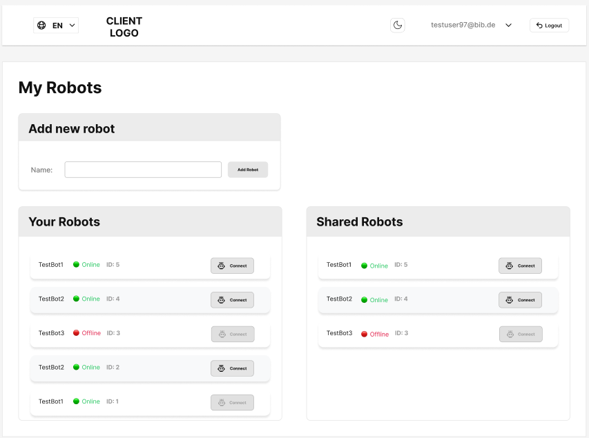
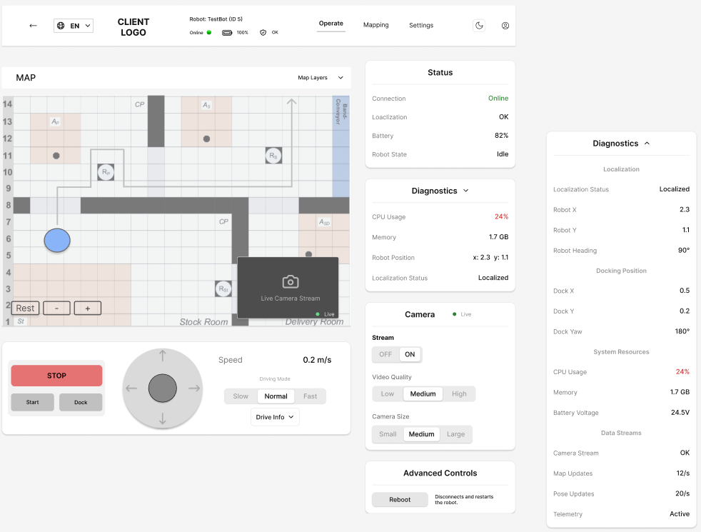
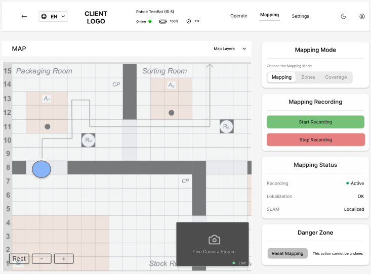
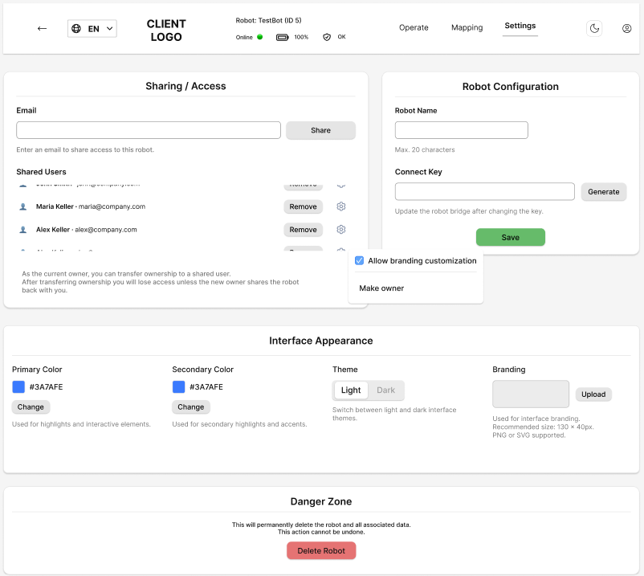

# robot-control-interface
UX/UI concept for a web-based mobile robot control interface in a B2B environment.

# Robot Control Interface – UX/UI Case Study

## Overview

This project presents a UX/UI concept for a web-based control interface for mobile robots in a professional B2B environment.

The interface is designed to support operators in monitoring robot status, controlling movement, and managing system configurations in a clear and structured way.

The project was developed for a real client (OWL Robotics).

---

## Problem

The existing system provided core technical functionality but lacked a clear and structured user interface.

Navigation was not intuitive, important actions were not clearly separated, and the overall interface increased cognitive load for users, especially in time-critical situations.

---

## Solution

A modular and structured interface was designed to improve usability and reduce complexity.

The system is divided into four main areas:

* **Overview** – entry point with a list of available robots
* **Operate** – real-time control and monitoring
* **Mapping** – navigation and environment interaction
* **Settings** – configuration and access management

The design focuses on clarity, hierarchy, and safe interaction.
Critical actions remain visible and accessible at all times.

---

## Key Features

* Centralized robot overview with status indicators
* Real-time control interface with map and camera integration
* Structured navigation between system areas
* Role-based access and permissions
* Persistent visibility of safety-critical controls
* Modular dashboard layout

---

## Screenshots

### Overview

Overview of available robots with status information.

### Operate

Real-time control and monitoring interface.

### Mapping

Map-based navigation and interaction.

### Settings

Configuration and system settings interface.

---

## Prototype

Figma prototype:
(https://www.figma.com/design/j4Ev6rxPdCfPUdz6ghlO6u/Robot-Portal-%E2%80%93-UX-UI-Konzept?node-id=913-497&p=f&t=oN18Nk0iG9LvuATn-0)

---

## Documentation

The project is supported by detailed documentation:

* [Requirements Specification (Pflichtenheft)](docs/pflichtenheft.pdf)
* [UX/UI Design Documentation](docs/Entwurfsdokumentation_UXUI_Roboterportal.pdf)
* [Implementation Documentation](docs/implementierung.pdf)

---

## Design Approach

The interface is based on a structured layout and reusable components.

A consistent design system was used to ensure scalability and clarity across all views.

---

## Collaboration

The initial prototype was created collaboratively.  
The overall UX structure, interaction logic, and system design were primarily developed by me.  
The documentation was prepared as part of the project context.

---

## Context

This project focuses exclusively on UX/UI design.

Backend logic, robot communication, and system infrastructure were not part of the implementation and are handled by the client.

---

## Author

Ramiz Niftaliev

